# vbracket

Custom legends with statistical comparison brackets for ggplot2

## Overview

`vbracket` is an R package that adds publication-quality custom legends with vertical brackets to ggplot2 plots. It's designed for displaying statistical comparisons between groups, commonly used in scientific publications for showing significance levels.

## Features

- ✅ **Easy Integration** - Works seamlessly with ggplot2 using the `+` operator
- ✅ **Flexible Comparisons** - Support for asterisks (*, **, ***), p-values (p<0.001), or custom labels
- ✅ **Adaptive Positioning** - Automatically adjusts to different plot sizes (4×3, 6×4, 8×6 inches)
- ✅ **Smart Layout** - Automatically detects and spaces overlapping brackets
- ✅ **Font Support** - Auto-inherits font family from ggplot2 theme (sans, serif, mono)
- ✅ **Precise Positioning** - Uses actual rendered text width for accurate bracket placement
- ✅ **Publication Ready** - Works with regular `ggsave()` for easy figure export

## Installation

### From GitHub

```r
# Install devtools if needed
install.packages("devtools")

# Install vbracket
devtools::install_github("h20gg702/vbracket")
```

### From Source

```r
# Clone the repository and source the files
source("R/helpers.R")
source("R/custom_legend_with_brackets.R")
source("R/annotation_grob.R")
source("R/ggplot_integration.R")
source("R/print_method.R")
source("R/ggsave_vbracket.R")
```

## Quick Start

```r
library(ggplot2)
library(vbracket)

# Prepare sample data
set.seed(42)
days <- c(0, 5, 10, 15, 20, 25)
groups <- c("WT", "WT/Dox", "CH3+5", "CH3+5/Dox", "PUMA-KO", "PUMA-KO/Dox")
colors <- c("WT" = "#00AA00", "WT/Dox" = "#FF4400", "CH3+5" = "#00AAFF",
            "CH3+5/Dox" = "#0000CC", "PUMA-KO" = "#AA7700", "PUMA-KO/Dox" = "#AA00FF")

df_line <- do.call(rbind, lapply(groups, function(grp) {
  if (grp == "WT/Dox") {
    mean_values <- c(0, 50, 150, 200, 500, 950)
  } else if (grp == "WT") {
    mean_values <- c(0, 50, 100, 350, 900, 2100)
  } else if (grp == "CH3+5") {
    mean_values <- c(0, 45, 95, 380, 950, 1900)
  } else if (grp == "CH3+5/Dox") {
    mean_values <- c(0, 48, 105, 360, 920, 2000)
  } else if (grp == "PUMA-KO") {
    mean_values <- c(0, 52, 110, 370, 880, 2150)
  } else {
    mean_values <- c(0, 50, 100, 355, 910, 2200)
  }
  sd_values <- mean_values * 0.08 + 10
  data.frame(days = days, volume = mean_values, sd = sd_values, group = grp)
}))

# Define statistical comparisons
# Note: These group comparisons are examples - replace with your own groups
comparisons <- add_bracket_comparisons(
  groups1 = c("WT/Dox", "CH3+5/Dox"),      # First groups to compare
  groups2 = c("CH3+5", "PUMA-KO"),         # Second groups to compare
  labels = c("*", "*")                      # Significance labels
)

# Create your plot
p <- ggplot(df_line, aes(x = days, y = volume, color = group, group = group)) +
  geom_line(linewidth = 1.2) +
  geom_point(size = 3) +
  geom_errorbar(aes(ymin = volume - sd, ymax = volume + sd), width = 1.2, linewidth = 0.8) +
  scale_color_manual(values = colors) +
  scale_x_continuous(breaks = c(0, 5, 10, 15, 20, 25), limits = c(0, 27)) +
  scale_y_continuous(breaks = seq(0, 2500, 500), limits = c(0, 2500)) +
  labs(title = expression(paste("HCT116 Sh ", italic("WRN"))),
       x = "Days",
       y = expression(paste("Tumor Volume (mm"^3, ")"))) +
  theme_classic(base_size = 14) +
  theme(plot.title = element_text(hjust = 0.5, size = 16, face = "bold"),
        legend.position = "none") +
  # Add vbracket legend
  legend_bracket(
    labels = groups,
    colors = colors,
    comparisons = comparisons,
    position = "topleft",
    output_width = 6,
    output_height = 4
  )

# Save with regular ggsave
ggsave("plot.png", p, width = 6, height = 4, dpi = 300)
```


## Examples

**Note:** The following examples use tumor volume data with specific group names (WT, WT/Dox, CH3+5, etc.) for demonstration purposes. Replace these with your own data and group names when using vbracket.

### Example 1: Basic Usage - Two Comparisons

```r
# Two comparisons between groups
comparisons <- add_bracket_comparisons(
  groups1 = c("WT/Dox", "CH3+5/Dox"),
  groups2 = c("CH3+5", "PUMA-KO"),
  labels = c("*", "*")
)

p <- ggplot(df_line, aes(x = days, y = volume, color = group, group = group)) +
  geom_line(linewidth = 1.2) +
  geom_point(size = 3) +
  geom_errorbar(aes(ymin = volume - sd, ymax = volume + sd), width = 1.2, linewidth = 0.8) +
  scale_color_manual(values = colors) +
  theme_classic(base_size = 14) +
  theme(legend.position = "none") +
  legend_bracket(labels = groups, colors = colors, comparisons = comparisons,
                 position = "topleft", output_width = 6, output_height = 4)

ggsave("example1_basic.png", p, width = 6, height = 4, dpi = 300)
```


### Example 2: Multiple Asterisk Symbols

Show different significance levels using asterisks:

```r
comparisons <- add_bracket_comparisons(
  groups1 = c("WT/Dox", "CH3+5/Dox", "PUMA-KO"),
  groups2 = c("CH3+5", "PUMA-KO", "PUMA-KO/Dox"),
  labels = c("*", "**", "***")  # *, **, *** for different p-values
)
```

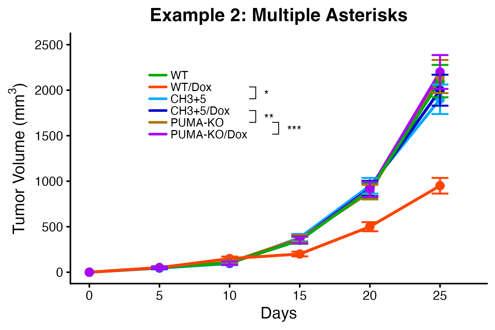

### Example 3: P-value Notation

Use p-value text instead of asterisks:

```r
comparisons <- add_bracket_comparisons(
  groups1 = c("WT/Dox", "CH3+5/Dox"),
  groups2 = c("CH3+5", "PUMA-KO"),
  labels = c("p<0.001", "ns")  # Explicit p-values or "ns" for not significant
)
```


### Example 4: Different Legend Positions

vbracket supports four preset positions:

```r
# Try different positions: "topleft", "topright", "bottomleft", "bottomright"
p + legend_bracket(labels, colors, comparisons,
                   position = "topright",  # Change position here
                   output_width = 6, output_height = 4)
```

| Top Left | Top Right |
|----------|-----------|
| 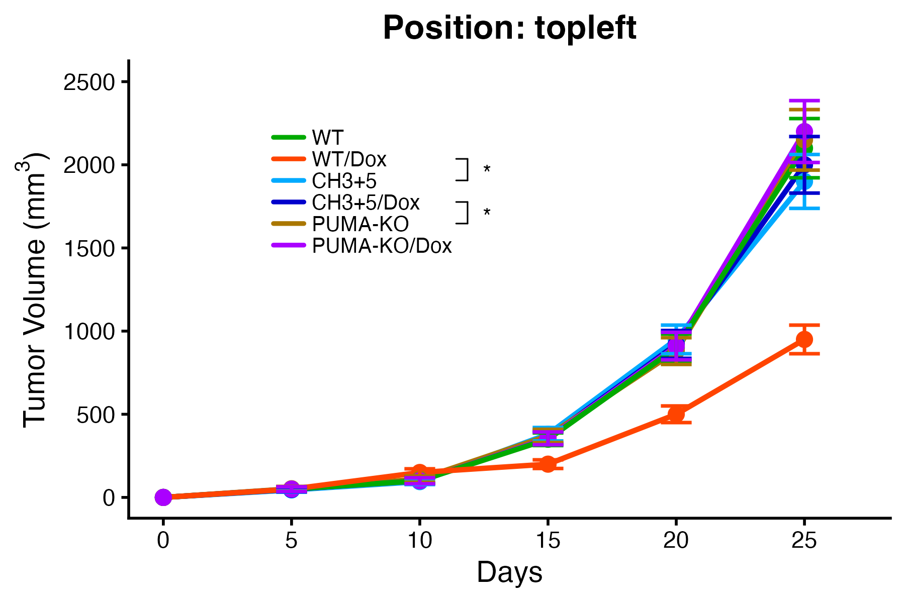 | 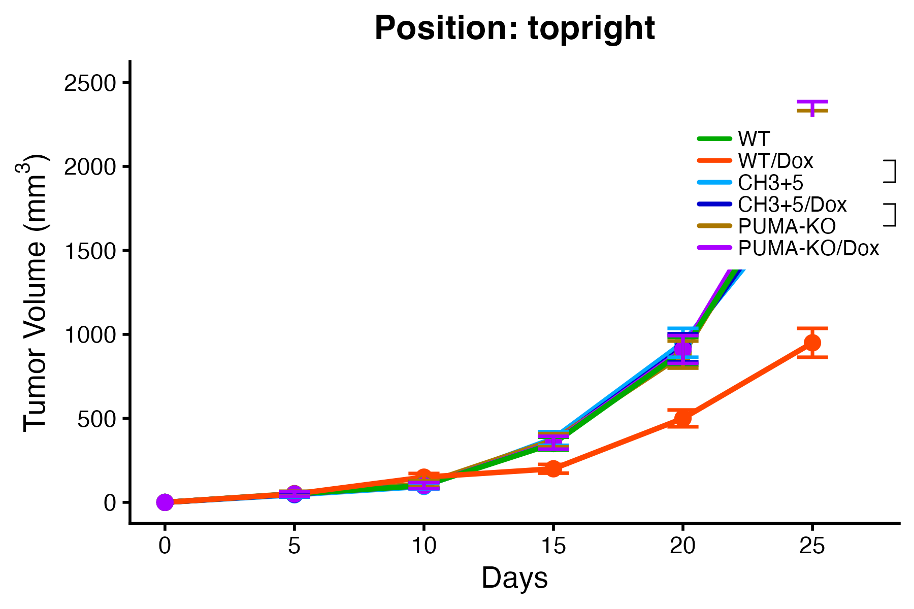 |

| Bottom Left | Bottom Right |
|-------------|--------------|
| 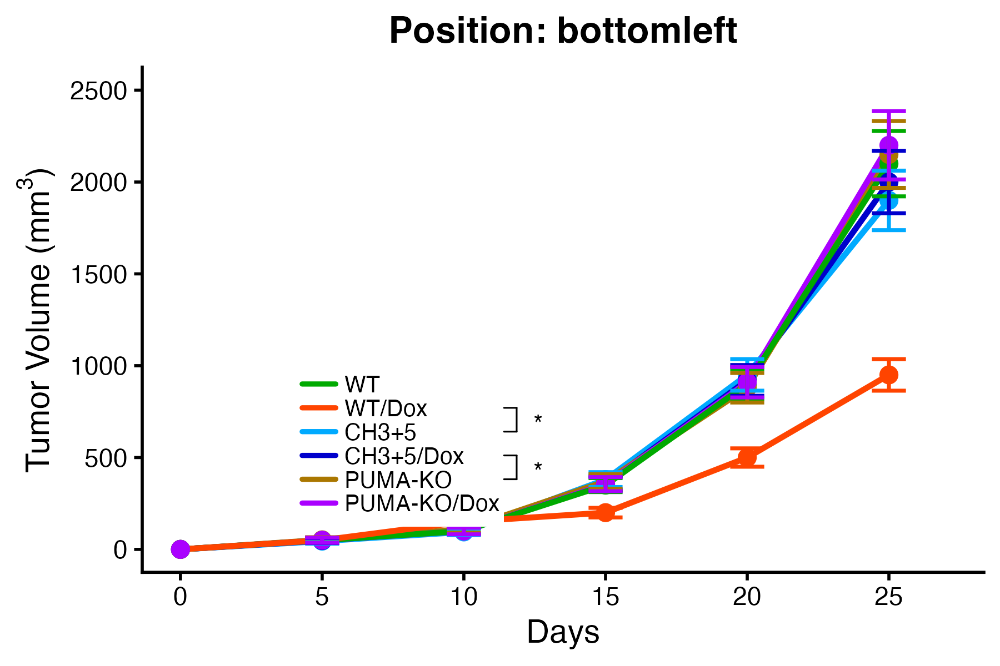 | 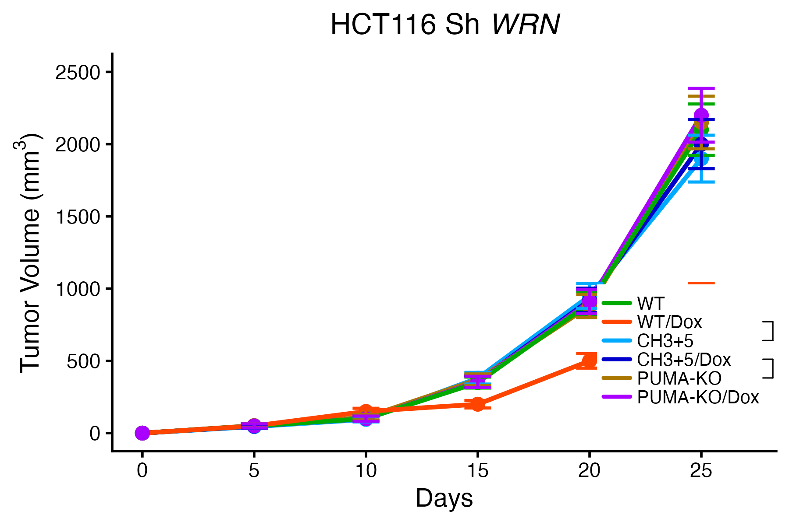 |

### Example 5: Custom Bracket Margin

Adjust the space between legend text and brackets:

```r
# Smaller margin (0.05) - brackets closer to text
p + legend_bracket(labels, colors, comparisons,
                   position = "topleft",
                   bracket_margin = 0.05,  # Adjust this value
                   output_width = 6, output_height = 4)
```

| Margin 0.05 | Margin 0.15 | Margin 0.30 |
|-------------|-------------|-------------|
|  | 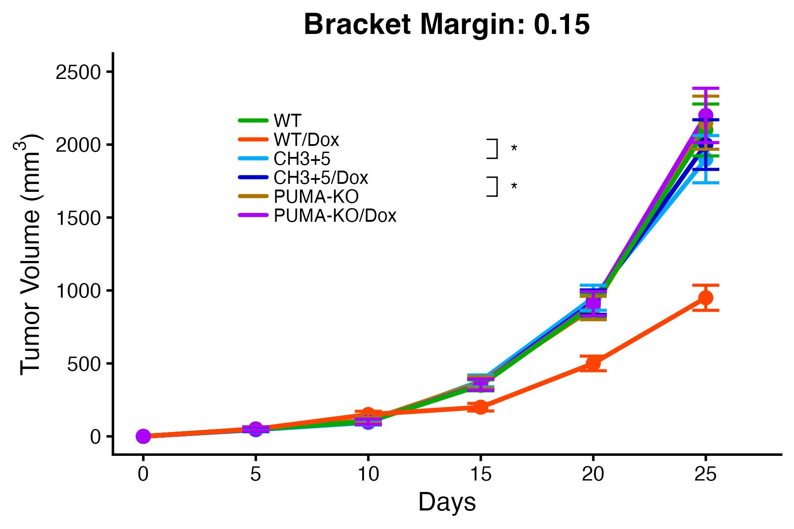 | 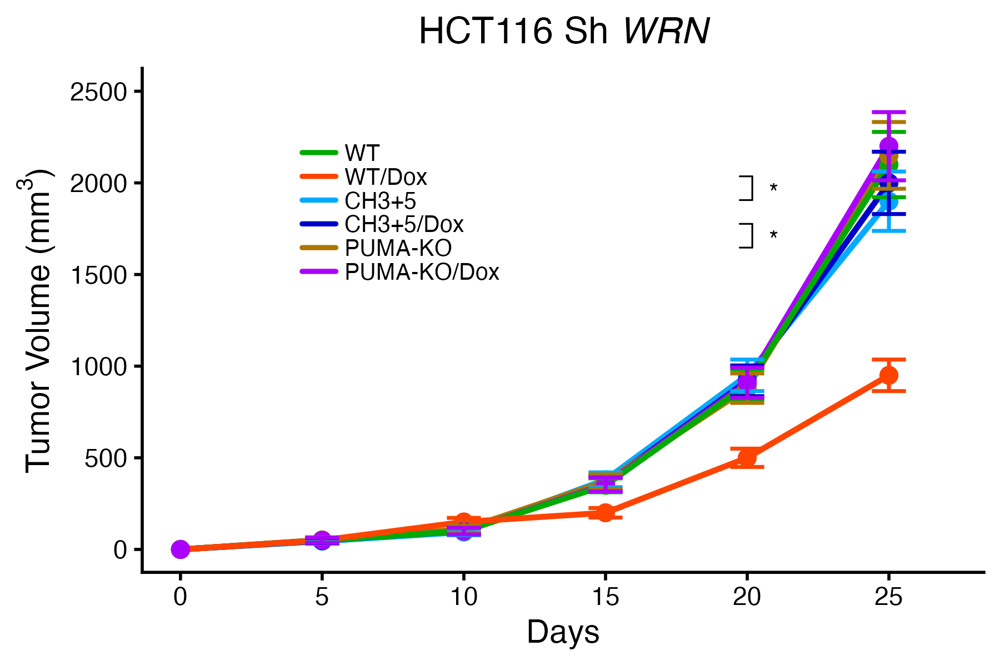 |

### Example 6: Adaptive Positioning for Different Plot Sizes

vbracket automatically adapts to different plot dimensions:

```r
# Small plot
p + legend_bracket(labels, colors, comparisons,
                   position = "topleft",
                   output_width = 4, output_height = 3)
ggsave("small.png", p, width = 4, height = 3)

# Medium plot
p + legend_bracket(labels, colors, comparisons,
                   position = "topleft",
                   output_width = 6, output_height = 4)
ggsave("medium.png", p, width = 6, height = 4)

# Large plot
p + legend_bracket(labels, colors, comparisons,
                   position = "topleft",
                   output_width = 8, output_height = 6)
ggsave("large.png", p, width = 8, height = 6)
```

| 4×3 inches | 6×4 inches | 8×6 inches |
|------------|------------|------------|
| 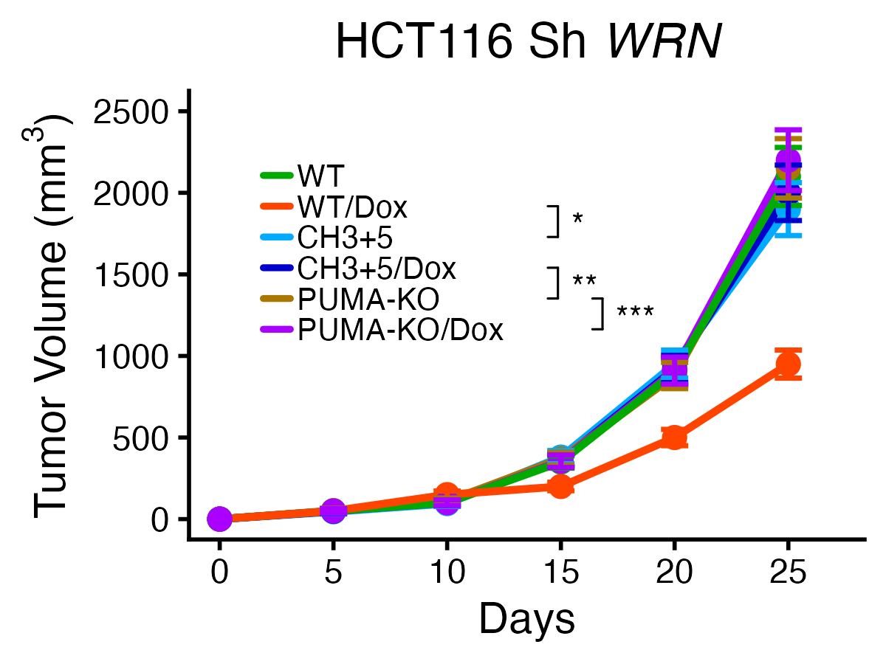 |  | 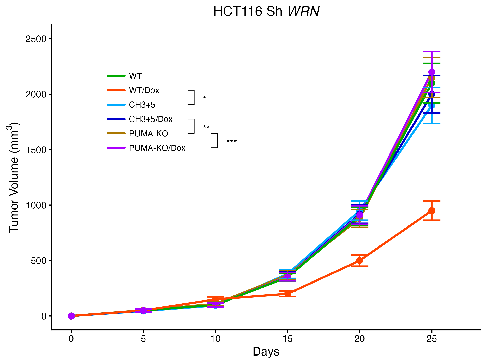 |

### Example 7: Font Family Support

vbracket automatically inherits font family from your ggplot theme:

```r
# Sans-serif font
p + theme_classic(base_family = "sans") +
    legend_bracket(...)

# Times New Roman (recommended for scientific publications)
p + theme_classic(base_family = "Times New Roman") +
    legend_bracket(...)

# Monospace font
p + theme_classic(base_family = "mono") +
    legend_bracket(...)
```

| Sans | Times New Roman | Mono |
|------|-----------------|------|
| 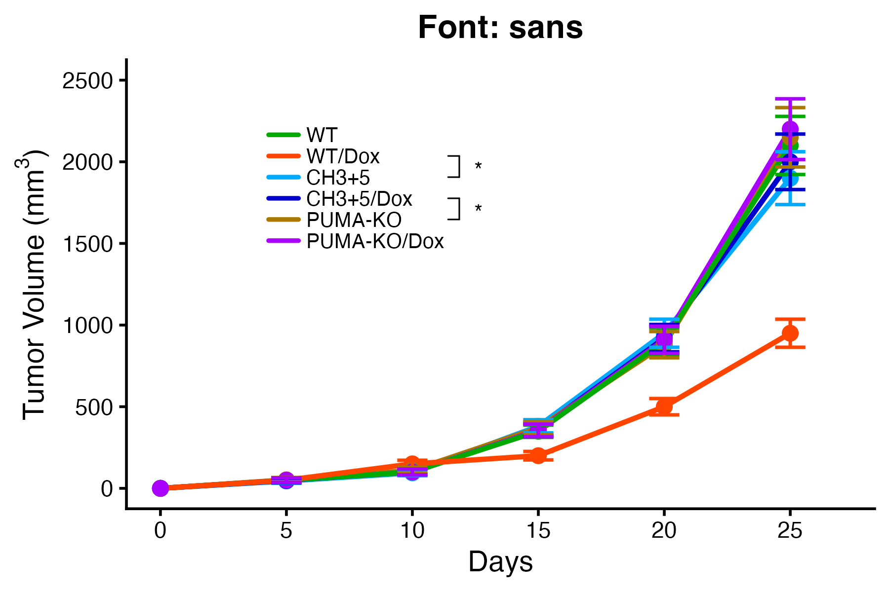 | 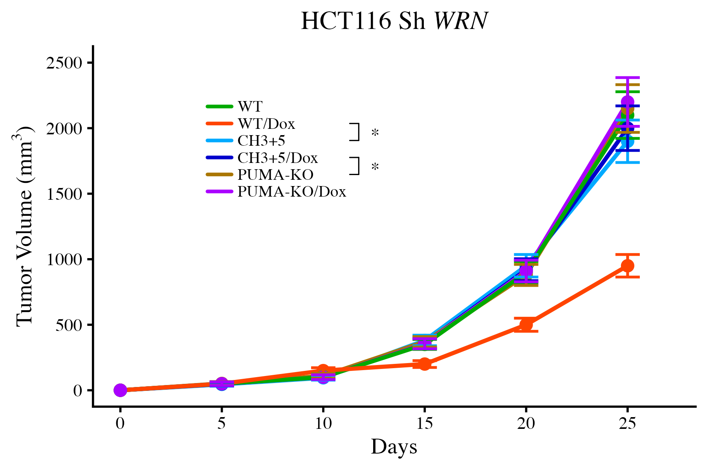 | 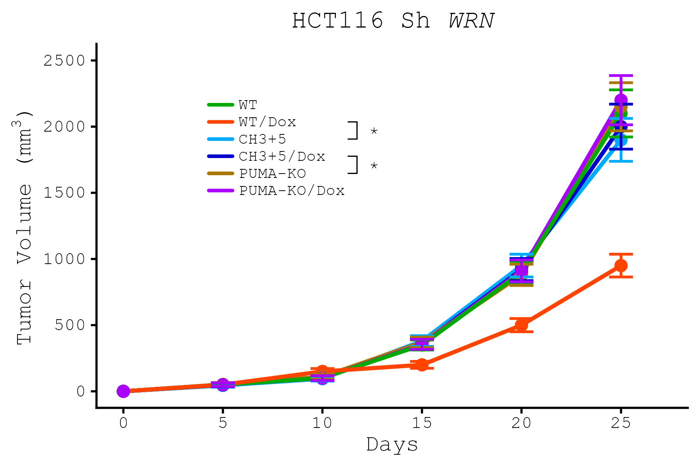 |

### Example 8: Custom Text Sizes

Customize legend text size and significance symbol size:

```r
# Small text
p + legend_bracket(labels, colors, comparisons,
                   position = "topleft",
                   text_size = 8,   # Legend text size
                   sig_size = 12,   # Significance symbol size
                   output_width = 6, output_height = 4)

# Medium text (default)
p + legend_bracket(..., text_size = 10, sig_size = 14, ...)

# Large text
p + legend_bracket(..., text_size = 12, sig_size = 18, ...)
```

| Small (8/12) | Medium (10/14) | Large (12/18) |
|--------------|----------------|---------------|
| 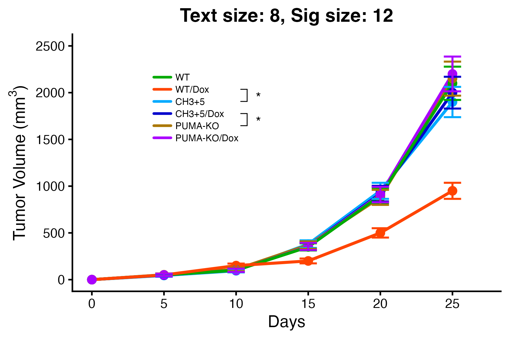 | 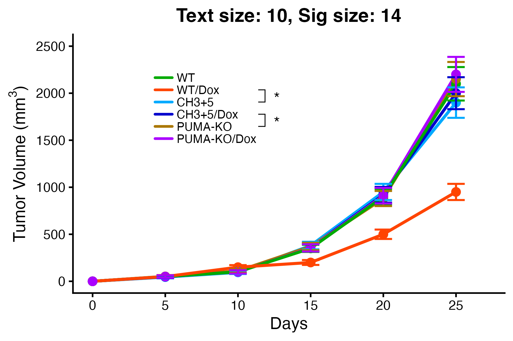 | 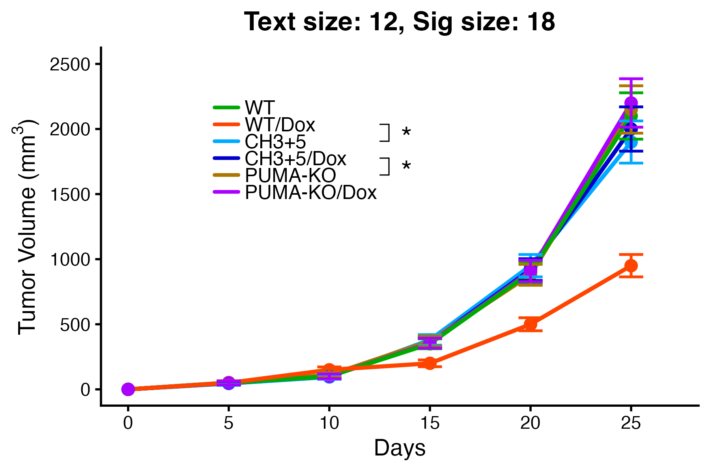 |

## Main Functions

### `add_bracket_comparisons()`

Create comparison specifications for brackets.

**Parameters:**
- `groups1` - Character vector of first groups to compare
- `groups2` - Character vector of second groups to compare
- `labels` - Character vector of significance labels (e.g., "*", "**", "p<0.05", "ns")

**Returns:** Data frame with comparison specifications

### `legend_bracket()`

Add custom legend with brackets to a ggplot object.

**Parameters:**
- `labels` - Character vector of group names (in order)
- `colors` - Named character vector of group colors
- `comparisons` - Comparison data frame from `add_bracket_comparisons()`
- `position` - Preset position: "topleft", "topright", "bottomleft", "bottomright"
- `output_width` - Output figure width in inches (required for METHOD 1)
- `output_height` - Output figure height in inches (required for METHOD 1)
- `bracket_margin` - Custom spacing between text and brackets (optional)
- `text_size` - Legend text size (default: 10)
- `sig_size` - Significance symbol size (default: 11)
- `text_family` - Font family (default: inherits from ggplot theme)

**Returns:** A vbracket_legend object that can be added to ggplot

## Usage Methods

### METHOD 1: With Output Dimensions (Recommended)

Specify `output_width` and `output_height` to use with regular `ggsave()`:

```r
p <- ggplot(...) +
  legend_bracket(labels, colors, comparisons,
                 position = "topleft",
                 output_width = 6,
                 output_height = 4)

ggsave("plot.png", p, width = 6, height = 4)  # Regular ggsave works!
```

### METHOD 2: Without Output Dimensions

Use `ggsave_vbracket()` or `print()` for display:

```r
p <- ggplot(...) +
  legend_bracket(labels, colors, comparisons,
                 position = "topleft")

ggsave_vbracket("plot.png", p, width = 6, height = 4)  # Custom save function
# OR
print(p)  # Display in R/RStudio
```

## Advanced Features

### Custom Positioning

Override automatic positioning with custom coordinates:

```r
legend_bracket(labels, colors, comparisons,
               legend_x = 0.15,
               legend_y = 0.85,
               output_width = 6,
               output_height = 4)
```

### Custom Bracket Spacing

Adjust the space between legend text and brackets:

```r
legend_bracket(labels, colors, comparisons,
               position = "topleft",
               bracket_margin = 0.10,
               output_width = 6,
               output_height = 4)
```

### Font Customization

Font family is automatically inherited from ggplot theme:

```r
p <- ggplot(...) +
  theme_classic(base_family = "serif") +  # vbracket inherits serif
  legend_bracket(...)
```

Or specify manually:

```r
legend_bracket(labels, colors, comparisons,
               text_family = "serif",
               text_size = 11,
               sig_size = 14)
```

## Tutorial Scripts

The package includes comprehensive tutorial scripts:

### `getting_started.R`

Complete beginner's guide with 8 examples covering:
1. Basic usage with single comparison
2. Multiple asterisks (*, **, ***)
3. P-value notation (p<0.001, ns)
4. All legend positions
5. Custom bracket margins
6. Different plot sizes
7. Font family support
8. Custom text sizes

**Run the tutorial:**
```r
source("getting_started.R")
```

### `test_all_features.R`

Comprehensive test suite with 10 feature tests:
1. Basic usage
2. Multiple asterisk symbols
3. P-value notation
4. All legend positions
5. Custom positioning
6. Custom bracket margin
7. Adaptive positioning for different plot sizes
8. Font family inheritance
9. Adaptive bracket spacing
10. Non-overlapping bracket detection

**Run the tests:**
```r
source("test_all_features.R")
```

## How It Works

### Accurate Text Width Calculation

vbracket uses grid graphics' `grobWidth()` to calculate the actual rendered width of legend text, ensuring brackets are positioned precisely without overlapping:

```r
# Instead of estimating based on character count
text_width <- max(sapply(labels, function(label) {
  tg <- textGrob(label, gp = gpar(fontsize = text_size, fontfamily = text_family))
  convertWidth(grobWidth(tg), "npc", valueOnly = TRUE)
}))
```

### Adaptive Bracket Spacing

Brackets automatically adjust spacing based on:
- **Label type**: Asterisks use narrower spacing (0.06), text labels use wider spacing (0.10)
- **Plot size**: Smaller plots get relatively more spacing
- **Text size**: Larger text gets proportionally more spacing

### Overlap Detection

When multiple brackets would overlap, vbracket automatically spaces them horizontally:

```r
# Detects overlapping Y ranges
if (!(max_y_i < min_y_j || min_y_i > max_y_j)) {
  bracket_layers[i] <- max(bracket_layers[i], bracket_layers[j] + 1)
}
```

### Symbol Centering

Asterisks are positioned slightly lower than text symbols for better visual centering:

```r
if (grepl("^\\*+$", label)) {
  sig_y <- mid_y - (sig_size / 72) * 0.050  # Lower for asterisks
} else {
  sig_y <- mid_y + (sig_size / 72) * 0.003  # Standard for text
}
```

## Package Structure

```
vbracket/
├── R/
│   ├── helpers.R                         # Utility functions
│   ├── annotation_grob.R                 # METHOD 1 implementation
│   ├── custom_legend_with_brackets.R     # METHOD 2 implementation
│   ├── ggplot_integration.R              # Main user interface
│   ├── print_method.R                    # Display support for METHOD 2
│   └── ggsave_vbracket.R                 # Save support for METHOD 2
├── getting_started.R                      # Beginner tutorial
├── test_all_features.R                    # Comprehensive test suite
└── README.md                              # This file
```

## Tips for Best Results

1. **Always specify output dimensions** for publication-quality figures:
   ```r
   legend_bracket(..., output_width = 6, output_height = 4)
   ggsave("plot.png", p, width = 6, height = 4)
   ```

2. **Match dimensions exactly** between `legend_bracket()` and `ggsave()`:
   ```r
   # GOOD
   legend_bracket(..., output_width = 6, output_height = 4)
   ggsave("plot.png", p, width = 6, height = 4)

   # BAD - dimensions don't match
   legend_bracket(..., output_width = 6, output_height = 4)
   ggsave("plot.png", p, width = 8, height = 6)
   ```

3. **Hide default legend** to avoid conflicts:
   ```r
   theme(legend.position = "none")
   ```

4. **Use appropriate significance levels**:
   - `*` for p < 0.05
   - `**` for p < 0.01
   - `***` for p < 0.001
   - `ns` for not significant

5. **Check for overlaps** when using many comparisons - vbracket will auto-space them

## Troubleshooting

### Brackets overlapping with text

Increase the bracket margin:
```r
legend_bracket(..., bracket_margin = 0.15)
```

### Legend too close to Y-axis

Use custom positioning:
```r
legend_bracket(..., legend_x = 0.20)
```

### Brackets not appearing in saved file

Make sure to specify output dimensions:
```r
legend_bracket(..., output_width = 6, output_height = 4)
```

### Font not matching plot

Font should auto-inherit from theme, but you can override:
```r
legend_bracket(..., text_family = "serif")
```

## Requirements

- R >= 3.5.0
- ggplot2 >= 3.0.0
- grid (included with base R)

## License

MIT License

## Citation

If you use vbracket in your research, please cite:

```
@software{vbracket,
  title = {vbracket: Custom Legends with Statistical Comparison Brackets for ggplot2},
  author = {Yoshiaki Sato},
  year = {2025},
  url = {https://github.com/h20gg702/vbracket}
}
```

## Contributing

Contributions are welcome! Please feel free to submit a Pull Request.

## Support

For questions, issues, or feature requests, please open an issue on GitHub.

## Acknowledgments

Built with ggplot2 and the grid graphics system in R.
